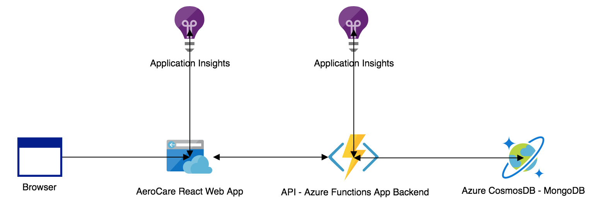

## Introduction 

Tech Stack includes .NET Core, Azure Functions, MongoDB, Git, Azure Pipelines and Postman Docs. 

## Complete API Documentation

https://documenter.getpostman.com/view/5756089/S11LsdCk

## App Architecture

